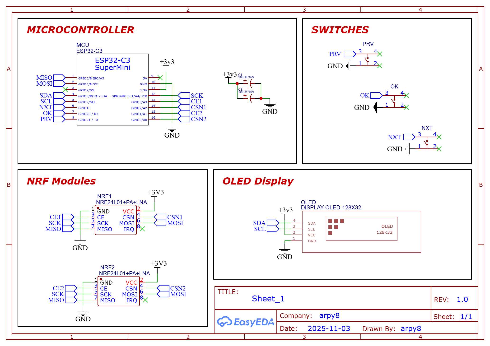
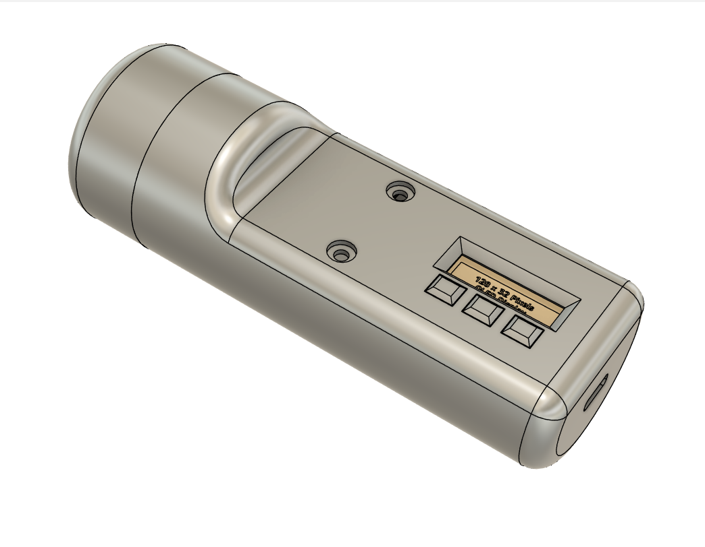
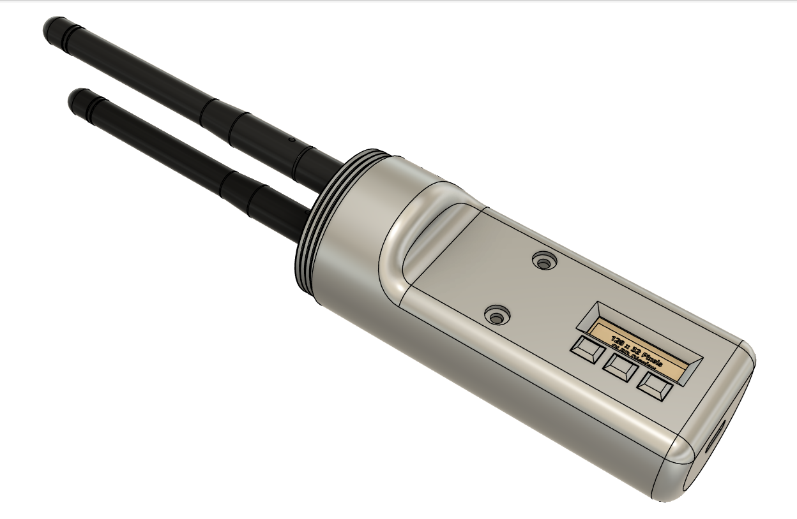

  
  <h1> 🌟 JamJam 🌟 </h1>

Welcome to the **JamJam** repository! 🎉 Dive into the world of RF interference with this unique project based on the ESP32-C3 and NRF24 technology.

## 📚 Table of Contents
<!-- - [🎯 Possible Additions](#-possible-additions) -->
<!-- - [🚀 What Can You Do with This?](#-what-can-you-do-with-this) -->
- [📋 List of Components](#-list-of-components)
- [🧑‍🔧 Let's Get Started with Soldering!](#-lets-get-started-with-soldering)
- [📦 Flash Firmware](#-flash-firmware)
- [🎮 Device Control](#-device-control)
- [🌐 Web Interface](#-Web-Interface)
- [🎉 Final Outcome](#-final-outcome)
- [🙏 Acknowledgments](#-acknowledgments)

<!-- -----

## 🎯 Possible Additions
- **Deauthentication attack**
- **BLE spam**
- **Beacon spam**
- **nRF24 mousejack**

***`If you have the capability to assist with these features, please feel free to create pull requests!`***

----- -->

## 🚀 What Can You Do with This?
This amazing jammer is built on the **ESP32-C3** architecture integrated with **configurable numbers of NRF24** modules. With its extraordinary capabilities, you can effectively disrupt signals across different technologies including:
- **Bluetooth** 🔊
- **BLE** 📱
- **Drones** 🚁
- **Wi-Fi** 📶
- **Zigbee**📡

-----

## 📋 List of Components
To bring this project to life, you will need the following components:

| Name | Designator | Link (Robu) | Quantity | Unit Price (₹) | Amount (₹) |
|------|-------------|------|-----------|----------------|-------------|
| 100nF | C1 | [TCC0805X7R104K101DT – CCTC 100nF Capacitor](https://robu.in/product/tcc0805x7r104k101dt-cctc-smt-ceramic-capacitors-0805-x7r-104k100nf%c2%b110-rated-voltage100v-thickness0-85mmtape/) | 2 | 6 | 12 |
| ESP32-C3 Development Board with Soldering | MCU | [ESP32-C3 Development Board](https://robu.in/product/esp32-c3-development-board-with-soldering/) | 1 | 257 | 257 |
| 0.91 inch 128×32 Blue OLED Display Module with I2C/IIC Serial Interface | OLED | [Blue OLED Display Module](https://robu.in/product/blue-oled-display-module/) | 1 | 144 | 144 |
| 2.4GHz NRF24L01+PA+LNA SMA Wireless Transceiver Antenna | NRF1, NRF2 | [NRF24L01+PA+LNA Module](https://robu.in/product/2-4ghz-nrf24l01palna-sma-antenna-wireless-transceiver-communication-module-1km/) | 2 | 135 | 270 |

-----

## 🧑‍🔧 Let's Get Started with Soldering!

### Connecting First nRF24 module
| **Pin Name** | **ESP32 GPIO** | **Connection**       |
|--------------|----------------|----------------------|
| VCC          | 3.3V           | (+) capacitor        |
| GND          | GND            | (-) capacitor        |
| CE           | GPIO 13        |                      |
| CSN          | GPIO 14        |                      |
| SCK          | GPIO 12        |                      |
| MISO         | GPIO 5         |                      |
| MOSI         | GPIO 6         |                      |
| IRQ          |                |                      |

### Connecting Second nRF24 module
| **Pin Name** | **ESP32 GPIO** | **Connection**       |
|--------------|----------------|----------------------|
| VCC          | 3.3V           | (+) capacitor        |
| GND          | GND            | (-) capacitor        |
| CE           | GPIO 15        |                      |
| CSN          | GPIO 16        |                      |
| SCK          | GPIO 12        |                      |
| MISO         | GPIO 5         |                      |
| MOSI         | GPIO 6         |                      |
| IRQ          |                |                      |

### OLED Connection
| **Pin Name** | **ESP32 GPIO** |
|--------------|----------------|
| VCC          | 3.3V           |
| GND          | GND            |
| SDA          | GPIO 8         |
| SCL          | GPIO 9         |

### Button Connection
| **Button Actions** | **ESP32 GPIO** |
|--------------------|----------------|
| OK                 | GPIO 20        |
| NEXT               | GPIO 10        |
| PREVIOUS           | GPIO 21        |

### Schematic

-----

## 📦 Flash Firmware

<strong>Manual Update</strong>

Follow these steps to flash the firmware:
1. Download the firmware from the **[releases](https://github.com/W0rthlessS0ul/nRF24_jammer/releases)** section that corresponds to your display.
2. Navigate to **ESPWebTool**: [ESPWebTool](https://esp.huhn.me/)
3. Arrange the files as per the table below:

| **Address** | **File Name**                             |
|-------------|-------------------------------------------|
| 0x1000      | nRF24_jammer_bootloader.bin              |
| 0x8000      | nRF24_jammer_partitions.bin              |
| 0x10000     | nRF24_jammer.bin                          |

4. Click "Flash," and once the installation is complete, **restart your board** and enjoy using your jammer!

<strong>OTA upgrade</strong>

### This method can only be used if you have firmware version 1.9 or higher installed.
Follow these steps to flash the firmware:
1. Download the firmware from the **[releases](https://github.com/W0rthlessS0ul/nRF24_jammer/releases)** section that corresponds to your display.
2. Turn on your device and open a web browser
3. Navigate to the web interface at **192.168.4.1**
4. Click on "**OTA**" and select the file "**nRF24_jammer.bin**" (`⚠️️ make sure not to choose the bootloader or partitions files`).

-----

## 🎮 Device Control 

#### 📋 Menu Navigation
- **OK button** short press → Select menu item
- **Next button** short press → Next menu item
- **Previous button** short press → Previous menu item

#### 📡 Misc Jammer
- **OK button** short press → Select channel
- **Next button** short press → Channel +1
- **Next button** long press → Continuous channel +1 (every 100ms)
- **Previous button** short press → Channel -1
- **Previous button** long press → Continuous channel -1 (every 100ms)

> **Single press** stops active attacks

-----

## 🌐 Web Interface

- To utilize the web interface, please follow the steps outlined below.
1. activate the **nRF24 jammer**.
2. Connect to the Wi-Fi network named `JamJam` using the password `poopoo`.
3. open your web browser and navigate to the IP address `192.168.4.1`.
4. Now you can control your nRF24 jammer through an web interface.

-----

## 🎉 Final Outcome

### CAD Model (To be printed)
|Closed|Open|
|-|-|
|||

### Normal Spectrum

### Bluetooth Jam Spectrum

### Drone Jam Spectrum

### Wi-Fi Jam Spectrum

### BLE Jam Spectrum

### Zigbee Jam Spectrum

-----

## 🙏 Acknowledgments
- [W0rthlessS0ul](https://github.com/W0rthlessS0ul)

-----